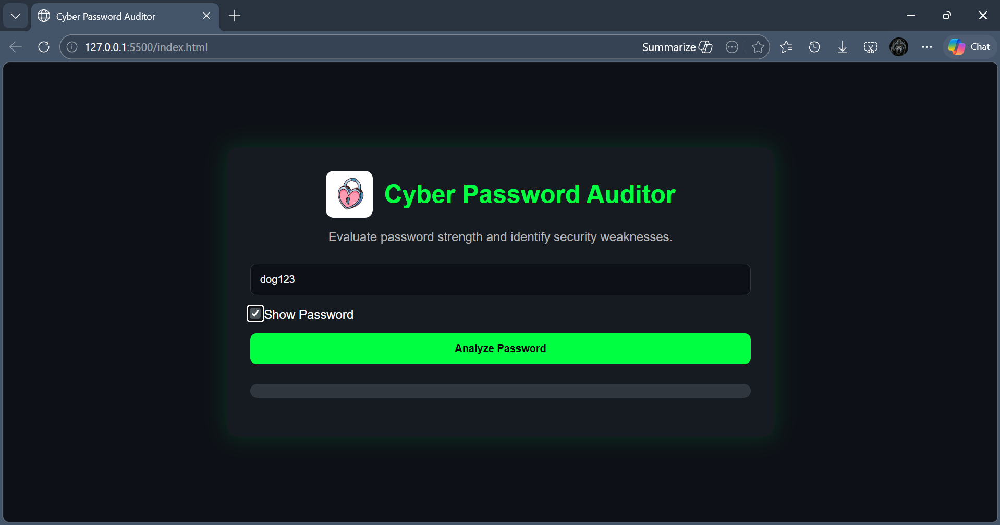
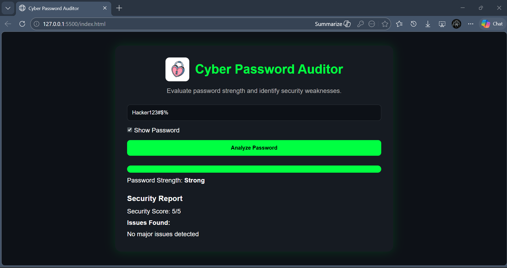
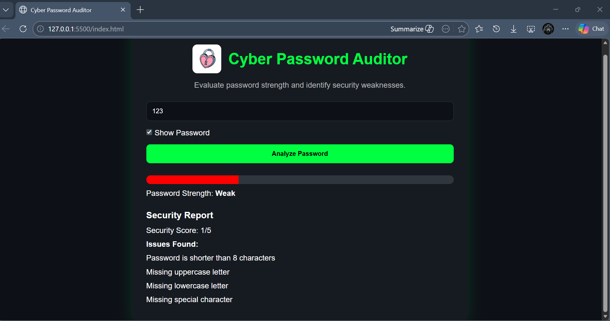

# Cyber Password Auditor

A cybersecurity-focused password auditing tool that evaluates password strength and identifies common security weaknesses.

## Features

- Password strength analysis
- Security score calculation
- Show/Hide password
- Weakness detection
- Security recommendations
- Strength meter visualization

## Technologies

- HTML
- CSS
- JavaScript

## Screenshots

### Home Screen

### Strong Password Analysis

### Weak Password Analysis

## How To Run

1. Clone the repository
2. Open `index.html`
3. Enter a password
4. Click **Analyze Password**

## Future Improvements

- Password entropy calculation
- Crack-time estimation
- Common password detection
- Breached password checking

## Author

Mishen